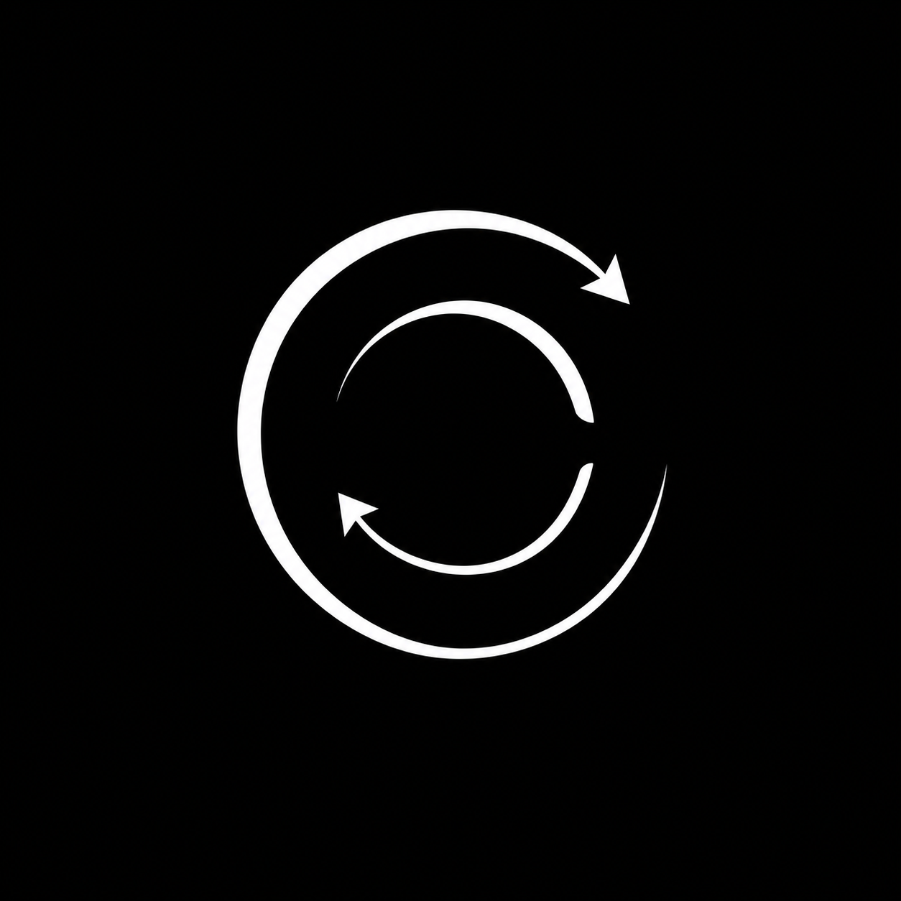

<p align="center">
  
</p>

<h1 align="center">VeriLoop E2</h1>

<p align="center">
  <strong>27B Post-Trained Model for Code, Mathematics, and Physics</strong><br>
  <em>VeriLoop-Governed Recurrence (VGR) for Evidence-Convergent Reasoning</em><br><br>
  <strong>Built on Qwen3.8-27B · 262K native context · Apache License 2.0</strong><br>
  <strong>Developed by Tsinghua SIGS Robot Lab · Libo Wang</strong>
</p>

<p align="center">
  <a href="https://www.apache.org/licenses/LICENSE-2.0"></a>
  
  
  
  
</p>

<p align="center">
  <a href="https://huggingface.co/tsinghua-sigs-robot-lab/VeriLoop-E2"><strong>Model</strong></a> ·
  <a href="xxxx"><strong>Technical Report</strong></a> ·
  <a href="https://huggingface.co/datasets/tsinghua-sigs-robot-lab/VeriLoop-E2-Evaluation-Evidence"><strong>Evaluation Evidence</strong></a> ·
  <a href="https://github.com/brucewang123456789/GeniusTrail/tree/VeriLoop-E2/riemann-hypothesis"><strong>Riemann ζ Artifact</strong></a> ·
  <a href="xxxx"><strong>GitHub</strong></a> ·
  <a href="xxxx"><strong>Zenodo</strong></a>
</p>

---

## Overview

**VeriLoop E2** is an open 27B post-trained model built on **Qwen3.8-27B**, targeting **code, mathematics, and physics**. Its core reasoning discipline is **VeriLoop-Governed Recurrence (VGR)**: candidate states are recursively proposed, externally checked, and retained only when the protected evidence state improves without regression.

The system separates generative intelligence from verification authority. **VeriLoop E2** is responsible for proposal generation, abstraction, diagnosis, repair hypotheses, and structured reasoning. The **VeriLoop Harness** governs evidence admission, deterministic checks, external verification, commit/rollback, stopping, and evidence-state persistence. The model therefore does not self-certify its own progress.

This release focuses on the model weights, public inference path, evaluation record, and public functional description of the Harness. The production Harness implementation itself is **not included** in this repository.

### Release highlights

- **27B open-weight post-trained model** for code, mathematics, and physics, derived from Qwen3.8-27B.
- **262,144-token native context window** in the released tokenizer configuration.
- Strong release results across nine code-agent, mathematics, and science benchmarks, including **76.2% SWE-bench Pro**, **88.8% Terminal-Bench 2.1**, **98.3% AIME 2026**, **93.9% GPQA Diamond**, and **89.6% Apex 2025**.
- A reproducible scientific-reasoning program built around verifier-governed recurrence rather than unconstrained retry.
- Two public-facing scientific demonstrations: a strict finite-dimensional **Riemann ζ zero-proportion certificate at 67.350003708785593%**, and **Asymptotic Graviton Tomography** for the black-hole information problem.
- OpenAI-compatible serving through **vLLM 0.17.0** with a validated 131,072-token serving configuration.

---

## Model Summary

| Property | VeriLoop E2 |
|---|---|
| Model family | VeriLoop E2 |
| Base model | Qwen3.8-27B |
| Parameter class | 27B |
| HF architecture class | `Qwen3_5ForConditionalGeneration` |
| Training stage | Post-Training |
| Primary domains | Code, software engineering, mathematics, physics |
| Public post-training corpus accounting | 1,841,831 records |
| Native context length | 262,144 tokens |
| Validated vLLM serving length | 131,072 tokens |
| Tokenizer class | `Qwen2Tokenizer` |
| Weight format | `safetensors` |
| Languages | English, Chinese |
| Recommended serving engine | vLLM 0.17.0 |
| Model-weight license | Apache License 2.0 |
| Release year | 2026 |

The post-training mix spans repository-level software engineering, terminal and tool use, mathematical reasoning, scientific reasoning, verifier-sensitive repair, and recurrence-oriented training. Exact data construction, filtering, and training methodology are documented in the technical report rather than duplicated here.

---

## Benchmark Results

The README reports the **frozen release scores** for VeriLoop E2. Agentic benchmarks use the E2 checkpoint inside the frozen evaluation workflow, including the internal VeriLoop Harness where required by the task, benchmark-native tools, and the benchmark's official or designated evaluator. Exact per-benchmark protocols, task-level outputs, evaluator receipts, and integrity metadata are published separately in the **Evaluation Evidence** package.

> **Attribution boundary.** The reported results characterize the evaluated E2 system configuration. They should not be interpreted as evidence that an untouched Qwen3.8-27B base checkpoint, or the E2 checkpoint outside the evaluated runtime, reproduces the same numbers.

<p align="center">
  
</p>

<p align="center">
  <sub><strong>Figure 1.</strong> VeriLoop E2 release snapshot across nine public benchmarks. Higher is better. Provider colors are fixed across panels; exact public model variants are shown in the comparison tables below. Full protocol and source provenance: <a href="https://huggingface.co/datasets/tsinghua-sigs-robot-lab/VeriLoop-E2-Evaluation-Evidence">Evaluation Evidence</a>.</sub>
</p>

### Code and agentic benchmarks

| Benchmark | **VeriLoop E2** | OpenAI | Anthropic | Kimi | GLM | Qwen | DeepSeek |
|---|---:|---:|---:|---:|---:|---:|---:|
| **SWE-bench Pro** | **[76.2](https://huggingface.co/datasets/tsinghua-sigs-robot-lab/VeriLoop-E2-Evaluation-Evidence/tree/main/swe-bench-pro)** | GPT-5.6 Sol 64.6 | Claude Fable 5.1 81.2 | — | GLM-5.2 Max 62.1 | Qwen3.8-Max 67.7 | DeepSeek V4 Pro Max 55.4 |
| **Terminal-Bench 2.1** | **[88.8](https://huggingface.co/datasets/tsinghua-sigs-robot-lab/VeriLoop-E2-Evaluation-Evidence/tree/main/terminal-bench-2.1)** | GPT-5.6 Sol 88.8 | — | Kimi K3 88.3 | GLM-5.3 88.2 | Qwen3.8-Max 86.6 | DeepSeek V4 Pro 87.9 |
| **DeepSWE v1.1** | **[64.6](https://huggingface.co/datasets/tsinghua-sigs-robot-lab/VeriLoop-E2-Evaluation-Evidence/tree/main/deepswe-1.1)** | GPT-5.6 Sol 72.7 | Claude Fable 5 69.7 | Kimi K3 67.5 | GLM-5.3 66.9 | — | DeepSeek V4 Pro 62.7 |
| **Terminal-Bench 3.0** | **[29.7](https://huggingface.co/datasets/tsinghua-sigs-robot-lab/VeriLoop-E2-Evaluation-Evidence/tree/main/terminal-bench-3.0)** | GPT-5.6 Sol 34.6 | Claude Fable 5 33.7 | Kimi K3 17.4 | GLM-5.3 28.3 | — | — |
| **Terminal-Bench 4.0** | **[37.9](https://huggingface.co/datasets/tsinghua-sigs-robot-lab/VeriLoop-E2-Evaluation-Evidence/tree/main/terminal-bench-4.0)** | GPT-6 Astra 59.6 | Claude Fable 5.1 55.1 | — | GLM-5.3 41.8 | — | — |
| **SWE-Marathon v1.1** | **[45.0](https://huggingface.co/tsinghua-sigs-robot-lab/VeriLoop-E2)** | GPT-5.6 Sol 42.5 | Claude Opus 4.8 48.8 | Kimi K3 48.1 | GLM-5.3 42.5 | — | — |

### Mathematics and science benchmarks

| Benchmark | **VeriLoop E2** | OpenAI | Anthropic | Kimi | GLM | DeepSeek | Gemini |
|---|---:|---:|---:|---:|---:|---:|---:|
| **AIME 2026** | **[98.3](https://huggingface.co/datasets/tsinghua-sigs-robot-lab/VeriLoop-E2-Evaluation-Evidence/tree/main/aime-2026)** | GPT-5.5 100.0 | Claude Opus 4.8 100.0 | Kimi K3 97.0 | — | DeepSeek V4 Pro 97.0 | Gemini 3.1 Pro 98.0 |
| **GPQA Diamond** | **[93.9](https://huggingface.co/datasets/tsinghua-sigs-robot-lab/VeriLoop-E2-Evaluation-Evidence/tree/main/gpqa-diamond)** | GPT-5.6 Sol 94.1 | Claude Fable 5 92.6 | Kimi K3 93.5 | GLM-5.2 Max 91.2 | — | — |
| **Apex 2025** | **[89.6](https://huggingface.co/datasets/tsinghua-sigs-robot-lab/VeriLoop-E2-Evaluation-Evidence/tree/main/apex-2025)** | GPT-5.5 80.0 | Claude Opus 4.8 81.0 | Kimi K3 66.0 | — | DeepSeek V4 Pro 28.0 | Gemini 3.1 Pro 61.0 |

A dash means that the release figure does not include a public comparison point for that provider on that benchmark. Each linked VeriLoop E2 score above resolves directly to its benchmark-specific public evidence directory or release source. External reference values mirror the frozen comparison set used in Figure 1; harness notes and protocol caveats are retained in the evaluation ledger rather than duplicated here. **Seven results currently map to Hugging Face Native Benchmark leaderboards:** AIME 2026, DeepSWE v1.1, GPQA Diamond, SWE-bench Pro, Terminal-Bench 2.1, Terminal-Bench 3.0, and Terminal-Bench 4.0. **Apex 2025 (89.6)** and **SWE-Marathon v1.1 (45.0)** are presented here as **laboratory self-published release results** with public source links. Apex 2025 is retained as a structured model result with public evidence, but `MathArena/apex_2025` is not currently a Hugging Face Native Benchmark leaderboard; SWE-Marathon v1.1 is reported on the model page because a stable Hugging Face benchmark registration/task identifier is not currently available.

### Evaluation evidence

The public evidence package is intended to make the benchmark record inspectable rather than merely declarative. Where available, each task record binds:

```text
task identity
    ↓
model / system output
    ↓
benchmark-native execution or evaluator record
    ↓
score / pass-fail decision
    ↓
integrity metadata and provenance
```

**Evidence repository:** [https://huggingface.co/datasets/tsinghua-sigs-robot-lab/VeriLoop-E2-Evaluation-Evidence](https://huggingface.co/datasets/tsinghua-sigs-robot-lab/VeriLoop-E2-Evaluation-Evidence)

| Benchmark | Public evaluation source |
|---|---|
| SWE-bench Pro | [https://huggingface.co/datasets/tsinghua-sigs-robot-lab/VeriLoop-E2-Evaluation-Evidence/tree/main/swe-bench-pro](https://huggingface.co/datasets/tsinghua-sigs-robot-lab/VeriLoop-E2-Evaluation-Evidence/tree/main/swe-bench-pro) |
| Terminal-Bench 2.1 | [https://huggingface.co/datasets/tsinghua-sigs-robot-lab/VeriLoop-E2-Evaluation-Evidence/tree/main/terminal-bench-2.1](https://huggingface.co/datasets/tsinghua-sigs-robot-lab/VeriLoop-E2-Evaluation-Evidence/tree/main/terminal-bench-2.1) |
| DeepSWE v1.1 | [https://huggingface.co/datasets/tsinghua-sigs-robot-lab/VeriLoop-E2-Evaluation-Evidence/tree/main/deepswe-1.1](https://huggingface.co/datasets/tsinghua-sigs-robot-lab/VeriLoop-E2-Evaluation-Evidence/tree/main/deepswe-1.1) |
| Terminal-Bench 3.0 | [https://huggingface.co/datasets/tsinghua-sigs-robot-lab/VeriLoop-E2-Evaluation-Evidence/tree/main/terminal-bench-3.0](https://huggingface.co/datasets/tsinghua-sigs-robot-lab/VeriLoop-E2-Evaluation-Evidence/tree/main/terminal-bench-3.0) |
| Terminal-Bench 4.0 | [https://huggingface.co/datasets/tsinghua-sigs-robot-lab/VeriLoop-E2-Evaluation-Evidence/tree/main/terminal-bench-4.0](https://huggingface.co/datasets/tsinghua-sigs-robot-lab/VeriLoop-E2-Evaluation-Evidence/tree/main/terminal-bench-4.0) |
| AIME 2026 | [https://huggingface.co/datasets/tsinghua-sigs-robot-lab/VeriLoop-E2-Evaluation-Evidence/tree/main/aime-2026](https://huggingface.co/datasets/tsinghua-sigs-robot-lab/VeriLoop-E2-Evaluation-Evidence/tree/main/aime-2026) |
| GPQA Diamond | [https://huggingface.co/datasets/tsinghua-sigs-robot-lab/VeriLoop-E2-Evaluation-Evidence/tree/main/gpqa-diamond](https://huggingface.co/datasets/tsinghua-sigs-robot-lab/VeriLoop-E2-Evaluation-Evidence/tree/main/gpqa-diamond) |
| Apex 2025 | [https://huggingface.co/datasets/tsinghua-sigs-robot-lab/VeriLoop-E2-Evaluation-Evidence/tree/main/apex-2025](https://huggingface.co/datasets/tsinghua-sigs-robot-lab/VeriLoop-E2-Evaluation-Evidence/tree/main/apex-2025) |
| SWE-Marathon v1.1 | [https://huggingface.co/tsinghua-sigs-robot-lab/VeriLoop-E2](https://huggingface.co/tsinghua-sigs-robot-lab/VeriLoop-E2) |

The model repository publishes **eight structured evaluation descriptors** under [`/.eval_results/`](https://huggingface.co/tsinghua-sigs-robot-lab/VeriLoop-E2/tree/main/.eval_results). Seven of them currently map to Hugging Face Native Benchmark leaderboards; the Apex 2025 descriptor is retained for structured reporting and provenance, but does not currently produce a Hugging Face leaderboard rank. SWE-Marathon v1.1 is published on the model page as a laboratory self-published release result and is therefore not included in `/.eval_results/`.

---

## VeriLoop Harness

VeriLoop is not designed around the idea that a model should announce its own improvement. The Harness treats model output as a **candidate state** that must earn admission through external evidence.

The current public abstraction is **VeriLoop-Governed Recurrence (VGR)**:

```text
Current request
    ↓
Contract compilation
    ↓
VeriLoop E2 proposes a candidate
    ↓
External / deterministic verification
    ↓
Protected evidence state comparison
    ├── no protected regression + at least one strict improvement → COMMIT
    ├── otherwise                                             → ROLLBACK
    └── zero-rank certificate                                → STOP
    ↓
Verified evidence becomes the next recurrence state
```

The key boundary is deliberate:

- **Model authority:** propose, reason, abstract, diagnose, synthesize, repair.
- **Harness authority:** admit evidence, execute deterministic checks, verify, commit, roll back, stop, and persist verified state.
- **Benchmark / domain authority:** define task truth through native evaluators, tests, formal checks, numerical certificates, or other domain-specific validators.

This architecture is intended to preserve capability while preventing self-reported success from becoming system state. In software engineering, that means tests and execution receipts dominate plausible-looking patches. In mathematics and physics, it means a retained derivation must survive the relevant symbolic, numerical, or formal checks before it is promoted.

The production implementation contains private orchestration, routing, thresholds, prompt compilation, evidence-state machinery, repair arbitration, and deployment controls. Those implementation details are not part of this open model release. The README exposes the **functional contract**, not the proprietary runtime.

---

## Public 14-Rule Engineering Contract

The public Golden Rules are the model-visible execution discipline used to keep long-horizon work bounded, testable, and auditable.

| # | Rule | Public meaning |
|---:|---|---|
| 1 | **Current Request Supremacy** | The current request and exact output contract override stale memory, templates, and unrelated context. |
| 2 | **Evidence Before Escalation** | Search, tools, reverse analysis, or repair are triggered by concrete missing evidence or observed failure, not instinct. |
| 3 | **Read Before Rewrite** | Inspect the relevant entry points, interfaces, tests, conventions, and failure signals before editing. |
| 4 | **Minimal Sufficient Implementation** | Produce the smallest complete artifact that satisfies the task and preserves required interfaces. |
| 5 | **Surgical Repair, Not Blind Regeneration** | Repair the broken invariant; broaden the rewrite only when evidence shows local repair is insufficient. |
| 6 | **Intent Tests Beat Cosmetic Tests** | Syntax and formatting matter, but functional intent is the decisive acceptance criterion. |
| 7 | **Fail Loud, Never Fake Success** | Unknowns, skipped checks, degraded states, and failures remain explicit; unexecuted validation is never reported as success. |
| 8 | **Deterministic Logic Belongs in Code** | Parsing, scoring, structural checks, transformations, and reproducible validation should be deterministic whenever possible. |
| 9 | **Budget Is a First-Class Contract** | Token, tool, time, and compute budgets are part of the task contract rather than afterthoughts. |
| 10 | **Tool Use Must Be Typed and Accountable** | Every tool action has a trigger, expected output, and defined downstream consumer. |
| 11 | **Checkpoint Long Tasks** | Persist useful candidate state, validation receipts, repair records, and progress across long-running work. |
| 12 | **Follow Local Conventions** | Respect repository, benchmark, filename, API, language, and artifact conventions unless the request explicitly changes them. |
| 13 | **One Final Deliverable, Full Evidence Bundle** | Select one deliverable while retaining the evidence needed to explain and reproduce why it was selected. |
| 14 | **Separate Core Discipline from Domain Overlays** | Domain- or benchmark-specific rules apply only when relevant and cannot override the current request. |

---

## Scientific Demonstrations

The scientific demonstrations are not presented as isolated chat transcripts. They are examples of how the E2 model and the internal Harness can divide a difficult research problem into candidate derivations, falsifiable subclaims, executable checks, and retained evidence.

### Riemann ζ: 67.350003708785593% strict finite-dimensional certificate

The released Riemann artifact reports a frozen assembly value of

$$
\kappa = 67.350003708785593\%.
$$

The current strict package closes **3/3 local inequalities**, resolves **327/327 difficult wells**, executes **190,375,830 strict branch-and-bound nodes**, and passes the final **exact rational assembly** check.

What this result **does** establish within the released artifact is a strict finite-dimensional computer-assisted certificate under its stated analytic setup and imported assumptions. What it **does not** establish is equally important:

- it is **not a proof of the Riemann Hypothesis**;
- it is **not yet an end-to-end Lean/nanoda kernel proof** of the complete upstream analytic chain;
- imported analytic normalization steps must remain clearly separated from the finite-dimensional certificate until the formal bridge and complete replay are closed.

The public package therefore emphasizes claim discipline, reproducibility, and certificate structure rather than treating a numerical percentage as a substitute for mathematical provenance.

**Artifact:** [https://github.com/brucewang123456789/GeniusTrail/tree/VeriLoop-E2/riemann-hypothesis](https://github.com/brucewang123456789/GeniusTrail/tree/VeriLoop-E2/riemann-hypothesis) · **Technical note:** `xxxx` · **Zenodo:** `xxxx`

### Black-hole information problem: Asymptotic Graviton Tomography

**Asymptotic Graviton Tomography** is the second scientific reasoning demonstration. It studies an information-reconstruction route through asymptotic gravitational observables, using the Harness to separate retained derivations from rejected or insufficiently supported branches.

The public claim is intentionally bounded: this is a **research demonstration of a verifier-governed theoretical-physics derivation**, not a declaration that the black-hole information paradox has been solved. The artifact is intended to expose the derivation structure, assumptions, checks, and remaining theoretical boundaries clearly enough for external scientific criticism.

**Artifact:** `xxxx` · **Technical note:** `xxxx`

> The Riemann and black-hole demo artifacts are released separately under **research-only, non-commercial terms**. They are not covered by the Apache-2.0 grant for the model weights and public inference utilities unless a specific file explicitly says otherwise.

---

## Inference

### Recommended environment

The following stack is the validated reference environment for the public serving path:

| Component | Version / setting |
|---|---|
| Python | 3.12.x |
| vLLM | 0.17.0 |
| PyTorch | 2.10.0 + CUDA 12.9 build |
| CUDA runtime | 12.9 |
| Transformers | 4.57.6 |
| Triton | 3.6.0 |
| Dtype | `bfloat16` |
| Validated serving context | 131,072 tokens |

The released tokenizer advertises a native maximum length of **262,144 tokens**. The 131,072-token value above is the **validated public serving configuration**, not a redefinition of the model's native context length. Longer serving windows require appropriate accelerator memory and KV-cache planning.

### vLLM server

Use the tokenizer and chat template shipped with the model repository.

```bash
python -m pip install "vllm==0.17.0"

MODEL="<MODEL_PATH_OR_HF_ID>"

vllm serve "${MODEL}" \
  --served-model-name veriloop-e2 \
  --dtype bfloat16 \
  --model-impl vllm \
  --language-model-only \
  --max-model-len 131072 \
  --max-num-seqs 16 \
  --gpu-memory-utilization 0.92 \
  --generation-config vllm \
  --disable-uvicorn-access-log \
  --host 127.0.0.1 \
  --port 8001
```

### OpenAI-compatible request

```bash
curl http://127.0.0.1:8001/v1/chat/completions \
  -H "Content-Type: application/json" \
  -d '{
    "model": "veriloop-e2",
    "messages": [
      {"role": "user", "content": "Reply exactly: 8001_OK"}
    ],
    "temperature": 0,
    "max_tokens": 16,
    "stream": false
  }'
```

A validated smoke test returns:

```text
8001_OK
```

### Python client

```python
from openai import OpenAI

client = OpenAI(
    base_url="http://127.0.0.1:8001/v1",
    api_key="EMPTY",
)

response = client.chat.completions.create(
    model="veriloop-e2",
    messages=[
        {"role": "user", "content": "Explain why rollback matters in verifier-governed reasoning."}
    ],
    temperature=0.2,
    max_tokens=1024,
)

print(response.choices[0].message.content)
```

### Protocol note

For tool use or long multi-turn reasoning, treat the repository-shipped tokenizer and chat template as part of the model protocol. Replacing role delimiters, tool-call syntax, stop semantics, or reasoning-history behavior can change observed system behavior even when the weights are unchanged.

---

## Release Boundary and Artifact Terms

Different artifacts intentionally carry different permissions. Do not infer that the model-weight license automatically applies to separately published scientific artifacts or private system components.

| Artifact | Public status | Terms |
|---|---|---|
| **VeriLoop E2 model weights, tokenizer, configuration** | Public | **Apache License 2.0** |
| **Public vLLM launch / inference utilities** | Public | **Apache License 2.0** |
| **Benchmark results and evaluation evidence** | Public / separately published | Reuse permitted with attribution to **VeriLoop E2 / Libo Wang**; upstream benchmark assets retain their original terms |
| **Riemann ζ scientific artifact** | Public / separately published | **Research-only, non-commercial**; see artifact-specific terms |
| **Asymptotic Graviton Tomography artifact** | Public / separately published | **Research-only, non-commercial**; see artifact-specific terms |
| **Production VeriLoop Harness implementation** | Not included | Not licensed by this release |

The open model license does not disclose or license unpublished Harness orchestration, prompt compilation, verifier routing, private evidence-state schemas, repair arbitration, deployment infrastructure, private training data, or other non-distributed internal systems.

---

## Limitations

- VeriLoop E2 is a post-trained model component; the complete production VeriLoop Harness is not part of this release.
- Reported system benchmarks may depend on benchmark-native tools, sandbox behavior, evaluator versions, and the frozen Harness configuration described in the evidence package.
- The model can still produce incorrect code, invalid proofs, physically unsupported arguments, insecure commands, or incomplete analyses.
- A plausible-looking derivation is not equivalent to a verified result; domain-native verification remains necessary.
- Long-context performance depends on serving configuration, accelerator memory, KV-cache budget, and workload shape.
- Community-modified templates, stop rules, parsers, or client logic can materially change observed tool-use and reasoning behavior.
- Scientific demonstration artifacts have explicit scope boundaries and should not be generalized beyond the claims actually certified by their released evidence.

---

## Links

| Resource | Link |
|---|---|
| Hugging Face model | [https://huggingface.co/tsinghua-sigs-robot-lab/VeriLoop-E2](https://huggingface.co/tsinghua-sigs-robot-lab/VeriLoop-E2) |
| Technical report | `xxxx` |
| Evaluation evidence | [https://huggingface.co/datasets/tsinghua-sigs-robot-lab/VeriLoop-E2-Evaluation-Evidence](https://huggingface.co/datasets/tsinghua-sigs-robot-lab/VeriLoop-E2-Evaluation-Evidence) |
| GitHub | `xxxx` |
| Riemann ζ artifact | [https://github.com/brucewang123456789/GeniusTrail/tree/VeriLoop-E2/riemann-hypothesis](https://github.com/brucewang123456789/GeniusTrail/tree/VeriLoop-E2/riemann-hypothesis) |
| Black-hole / Asymptotic Graviton Tomography artifact | `xxxx` |
| Zenodo DOI | `xxxx` |

Unresolved links in this table remain placeholders until their corresponding public artifacts are released. The Hugging Face model and evaluation-evidence links above are final public identifiers.

---

## Citation

If you use VeriLoop E2 in research, please cite the model release and the relevant evaluation or scientific artifact separately.

```bibtex
@misc{wang2026veriloope2,
  title        = {VeriLoop E2: A 27B Post-Trained Model for Code, Mathematics, and Scientific Reasoning},
  author       = {Wang, Libo},
  year         = {2026},
  note         = {Tsinghua Shenzhen International Graduate School (SIGS)},
  howpublished = {Open model release},
  url          = {https://huggingface.co/tsinghua-sigs-robot-lab/VeriLoop-E2}
}
```

For benchmark figures or evaluation records, attribution should identify **VeriLoop E2 / Libo Wang** and link to the public evaluation evidence package: [https://huggingface.co/datasets/tsinghua-sigs-robot-lab/VeriLoop-E2-Evaluation-Evidence](https://huggingface.co/datasets/tsinghua-sigs-robot-lab/VeriLoop-E2-Evaluation-Evidence).

---

## Acknowledgements

VeriLoop E2 builds on **Qwen3.8-27B** and the broader open-source model-serving, evaluation, and scientific-computing ecosystem. We thank the communities behind Qwen, Transformers, vLLM, Safetensors, software-engineering benchmarks, mathematical evaluation suites, and reproducible scientific computation.

The model, benchmark evidence, and scientific artifacts are published with explicit boundaries so that capability claims can be inspected at the level at which they were actually produced and verified.
